<!--
IsdaSure README - detailed, Soroban-focused project documentation
Author: generated by assistant (edit as needed)
-->


<p align="center">
  
</p>

[](https://isda-sure.vercel.app/)
[](https://stellar.expert/explorer/testnet/contract/CDNZVMTK3RNWWEQTG4JYC55O5P47YYTC2C2ACJVPI5MDJP63TH3KKKKS)
[](https://docs.rs/soroban-sdk/22.0.0)
[](https://vitejs.dev/)


<h2 align="center"><strong>IsdaSure: On-chain micro-insurance for coastal communities Soroban smart contracts on Stellar Testnet.</strong></h2>

---

## 🧭Overview

IsdaSure is a community-driven micro-insurance dApp that enables fisherfolk to contribute small, consistent amounts into a shared on-chain fund, creating a reliable financial safety net during no-fishing days. When storms or extreme weather prevent fishing, a Soroban smart contract on the Stellar network automatically distributes funds to contributors, ensuring immediate and fair support. By leveraging Stellar’s fast, low-cost, and transparent infrastructure, IsdaSure delivers a secure, accessible, and trustless system designed specifically for non-technical users in vulnerable coastal communities.

Key goals:
- 💸 Low-cost, frequent micro-contributions
- 🔍 Transparent, auditable on-chain accounting
- 🤝 Community-controlled storm-trigger and fair payout distribution
- 🔐 Wallet-based UX via Freighter (signing) and lightweight backend for state aggregation

---

## ❗Problem 

Juan, a small-scale fisherman in a coastal barangay in Batangas, loses all income for days during storms and is forced to take high-interest loans to survive, pushing his family into recurring debt and financial instability.

---

## 💡Solution 

With IsdaSure, Juan contributes small amounts via his wallet, and when a storm is triggered, a Soroban smart contract on the Stellar network automatically returns his funds instantly and transparently—leveraging Stellar’s low-cost, fast transactions to deliver reliable financial support without intermediaries.

Benefits:
- Immediate, transparent distribution of pooled funds when a storm is triggered.
- Minimal friction: small daily contributions, Freighter signing, and straightforward join/contribute flows.
- No intermediaries — on-chain settlement and verifiable history.

---

## ✨Core Functions & Features 

- 🔁 User flows: Register → Join/Create Group → Contribute → Receive payouts on Storm Day
- 🏷️ Group management: create groups, join requests, member approvals
- 📏 Contribution rules: configurable min/max, daily limits, and group-specific required daily amounts
- ⚡ Storm trigger: admin-authorized action that triggers on-chain payout calculation
- 🧩 Chain & mock modes: supports real RPC (when configured) and a mock fallback for unreliable RPCs

---

## 🔁How It Works (detailed flow) 

Below is a compact, step-by-step flow that describes user, backend, and contract interactions. The ASCII diagram shows decision points and RPC fallbacks so you can trace how the app behaves both when the Soroban RPC is healthy and when it is not.

Client / Backend / Contract flow (simplified):

```
User (browser) 🧑‍🌾         Backend API 🖥️            Soroban RPC / Contract 🦀
------------               -------------              ---------------------
Register -> POST /auth     -> backend saves user -> returns userId
  |                          (users.json)                |
  v                              v                       |
Join/Create Group -> POST /groups/create -> backend writes group -> returns groupId
  |                              |                       |
  v                              v                       |
Open Group page -> GET /groups -> backend returns members & pool state -> UI shows group

Contribute flow (daily) 💸:
User clicks "Contribute" 🧑‍🌾 -> frontend calls POST /contribute/prepare {groupId, amount}
  |
  +--> Backend `sorobanService.prepareTransaction` 🔧 attempts to build a Soroban `prepare` request
        |-- ✅ If RPC available & contract method exists: returns unsigned prepared XDR (mode: onchain)
        |-- ⚠️ If RPC returns account-not-found OR method-not-found OR network errors: backend
            returns a `mockPreparedTx` or a `manageData` fallback instruction (mode: fallback/mock)
  |
User's Freighter wallet signs prepared XDR 🔏 (or signs `manageData` fallback) -> frontend receives signature/XDR
  |
Frontend POST /contribute {signedXdr, mode} 📤 -> backend `sorobanService.submitSignedTransaction`
        |-- ✅ If RPC submit succeeds: backend polls tx status -> marks confirmed onchain
        |-- ❌ If submit fails or RPC unreachable: backend records a mocked confirmation with note
            (mode: mock) so the UX shows success and histories remain consistent
  |
Backend updates `pool.json` 🗄️, `groups.json` and app `chainHistory` -> UI refreshes to show contribution

Storm trigger (admin) ⛈️:
Admin clicks "Trigger Storm" -> frontend POST /triggerStorm
  |
  +--> backend validates admin and computes payout plan (split logic, eligible contributors) 🧮
        |-- Backend attempts to `prepare` contract-call for `distribute_payouts` 🔁
            |-- ✅ If RPC + contract available: prepare -> sign (admin) -> submit -> confirm onchain
            |-- ⚠️ If RPC not available: backend can produce a mocked distribution record and mark
                payouts in app state (with `note: mocked due to RPC`) so users still see results
  |
Contract (if onchain): verifies balances/eligibility -> executes transfers -> emits events -> tx confirmed ✅

Explorer / History 📜:
After onchain confirmation, backend stores explorer URL and tx details in `chainHistory` for UI.
If mocked, backend stores a synthetic record with `note` explaining the fallback.

Error & Edge Handling 🛠️:
- 🪪 Account not found: occurs when wallet never funded on testnet; prepare may fail. App offers
  `manageData` fallback so user can still sign and associate a contribution.
- 🔍 Method not found: node may not support Soroban contract methods; backend falls back to mock prepare.
- 🌐 DNS / ENOTFOUND: backend catches network errors, creates mock confirmations to preserve UX.
- 🧰 Vercel ephemeral FS: packaged data is copied to `/tmp` on first run so admin UI has seeded groups.
```

Step-by-step explanation (long form):

1) Register & group setup 🧾
   - 📝 User registers via the frontend (email/name or quick guest mode). Backend stores the record
     in `backend/data/users.json` and returns a `userId`.
   - 🏘️ A user can create or join a group. Groups are saved to `backend/data/groups.json`.

2) Prepare contribution (frontend -> backend) 🔧
   - 📨 When a user wants to contribute, the frontend calls POST `/contribute/prepare` with
     `groupId`, `amount`, and the currently connected wallet address.
   - ⚙️ Backend (`sorobanService`) tries to build a Soroban prepared transaction using the
     configured `SOROBAN_RPC_URL` and the contract's `contribute` method.
   - ✅ If the RPC and contract are healthy, backend returns an unsigned prepared XDR.
   - ⚠️ If prepare fails (account not found, method missing, DNS error), backend returns a
     `mockPreparedTx` or a minimal `manageData` fallback payload and sets `mode=fallback`.

3) Signing (wallet) 🔏
   - 🔐 The frontend asks Freighter to sign the prepared XDR (or fallback `manageData`). This ensures
     the wallet holder approves the action and the UX shows the expected signing flow.

4) Submit (frontend -> backend) 📤
   - 📬 Signed XDR is POSTed to `/contribute`. Backend attempts `submitSignedSorobanTransaction`.
   - ✅ On success: backend polls for final status, updates `pool.json`, and adds an onchain entry
     in `chainHistory` with an explorer URL.
   - ❌ On failure (or when in fallback/mock mode): backend records a mocked confirmation
     entry containing a `note` explaining why it was mocked. The UI shows success but marks
     the entry as `mock` for transparency.

5) Storm trigger & payouts ⛈️
   - 👤 An authorized admin triggers a storm via POST `/triggerStorm`.
   - 🧮 Backend calculates payout per eligible contributor (split by contribution shares).
   - ✅ If onchain: backend prepares `distribute_payouts`, admin signs+submits, and the contract
     performs transfers; backend stores the confirmed tx.
   - ⚠️ If RPC unavailable: backend writes mocked payouts to state and records `chainHistory` notes.

6) UX & transparency 👀
   - 📊 Contributions and payouts are visible in the UI. Mock confirmations are clearly marked
     with a `mock` note and may include an explanatory `note` or placeholder explorer link.
   - 🧰 Admin dashboard shows seeded groups (copied from packaged JSON to `/tmp` on hosted runtimes).

7) Production notes & moving to real on-chain mode 🚀
   - ⚙️ To enable real on-chain behavior set `SOROBAN_RPC_URL` and `SOROBAN_CONTRACT_ID` in Vercel.
   - 💰 Ensure admin wallet is funded on testnet so prepares/submits succeed and `account not found`
     errors are avoided during prepare.

This flow is intentionally tolerant: contributors always sign something (either prepared XDR or a
manageData fallback) and the backend records a clear audit trail whether the result was onchain or mocked.


---

## 📁Project Structure 

```
IsdaSure/                       📦 Project root
├─ backend/                     🖥️  Express API, services, file-backed data
│  ├─ app.js                    🚀  Express app entry
│  ├─ server.js                 ▶️  HTTP server / startup
│  ├─ routes/                   🔁  API route handlers (auth, contribute, groups)
│  ├─ services/                 ⚙️  Business logic (sorobanService, groupService, rpc)
│  └─ data/                     📄  Seeded JSON (groups.json, pool.json, users.json)
├─ contract/                    🦀  Soroban Rust smart contract source & tests
│  ├─ src/                      🧩  Rust sources (lib.rs, test.rs)
│  └─ test/                     🧪  Contract tests & snapshots
├─ frontend/                    🎛️  React + Vite frontend (Freighter integration)
│  ├─ src/                      🧭  Components, pages, context, hooks, services
│  ├─ public/                   🖼️  Static assets & favicon (images/icon2.png)
│  └─ package.json              📦  Frontend deps & scripts
├─ scripts/                     🔧  Utilities (contract checks, diagnostics)
├─ test_snapshots/              📸  Contract test snapshots used for regression tests
└─ README.md                    📘  This file
```

---

## 🏗️Architecture 

- Frontend: React + Vite, integrates with Freighter for signing, and calls backend APIs under `/_/backend/api` when hosted.
- Backend: Node.js + Express — manages groups, contributions, and prepares/submits Soroban transactions via the `SOROBAN_RPC_URL` (if configured). Uses packaged JSON files as seeded data and copies to a writable `/tmp` folder on serverless hosts.
- Contract: Soroban Rust contract manages contribution accounting and storm-trigger payouts.

---

## 🚢Deployment & Contract Addresses 

| Layer | Environment | Value |
|---|---:|---|
| Contract | Stellar Testnet | `CDNZVMTK3RNWWEQTG4JYC55O5P47YYTC2C2ACJVPI5MDJP63TH3KKKKS` |
| Network Passphrase | Testnet | `Test SDF Network ; September 2015` |
| Live Web App | Vercel | https://isda-sure.vercel.app |

---


## 🛠️Prerequisites 

- Node.js v18+
- Rust toolchain (for building Soroban contract) and `wasm32-unknown-unknown` target
- Soroban CLI (recommended for contract deploys)
- Freighter browser wallet configured for Stellar Testnet

---

## 🦀Smart Contract: Build / Test / Deploy (contract/)

1. Install the wasm target and build toolchain

```bash
rustup target add wasm32-unknown-unknown
```

2. Build the contract

```bash
cd contract
stellar contract build
```

3. Run tests

```bash
cargo test
```

4. (Optional) Deploy to testnet with Soroban / Stellar CLI

```bash
stellar keys generate --global my-admin-key --network testnet
stellar keys fund my-admin-key --network testnet
cd contract
stellar contract deploy --wasm target/wasm32-unknown-unknown/release/isdasure.wasm \
  --source my-admin-key --network testnet
```

---

## 🎛️Frontend: Local Setup (frontend/) 

1. Install dependencies

```bash
cd frontend
npm install
```

2. Configure `.env` (local development)

```
VITE_SOROBAN_CONTRACT_ID=CDNZVMTK3RNWWEQTG4JYC55O5P47YYTC2C2ACJVPI5MDJP63TH3KKKKS
VITE_RPC_URL=https://soroban-testnet.stellar.org
VITE_NETWORK_PASSPHRASE="Test SDF Network ; September 2015"
```

3. Run locally

```bash
npm run dev
```

Notes: The UI integrates with Freighter for signing. If `SOROBAN_RPC_URL` is missing on hosted environments, the backend falls back to a mock confirmation mode when `ALLOW_MOCK_ON_HOSTED=true`.

---
## ⛈️IsdaSure Webpage Content
IsdaSure is a blockchain-based web platform that enables fisherfolk communities to contribute, track funds, and receive fair, transparent emergency support through a secure and role-based system.

<table>
<tr>
<td width="50%" valign="top">
<b>Home page – Showcases IsdaSure’s platform for transparent, wallet-based support for fisherfolk communities.</b><br/><br/>
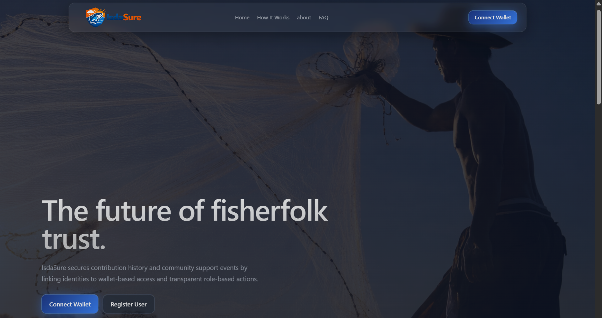<br/>
</td>
<td width="50%" valign="top">
<b>How It Works Page – Shows simple step-by-step instructions on how users join, contribute, and receive payouts.</b><br/><br/>
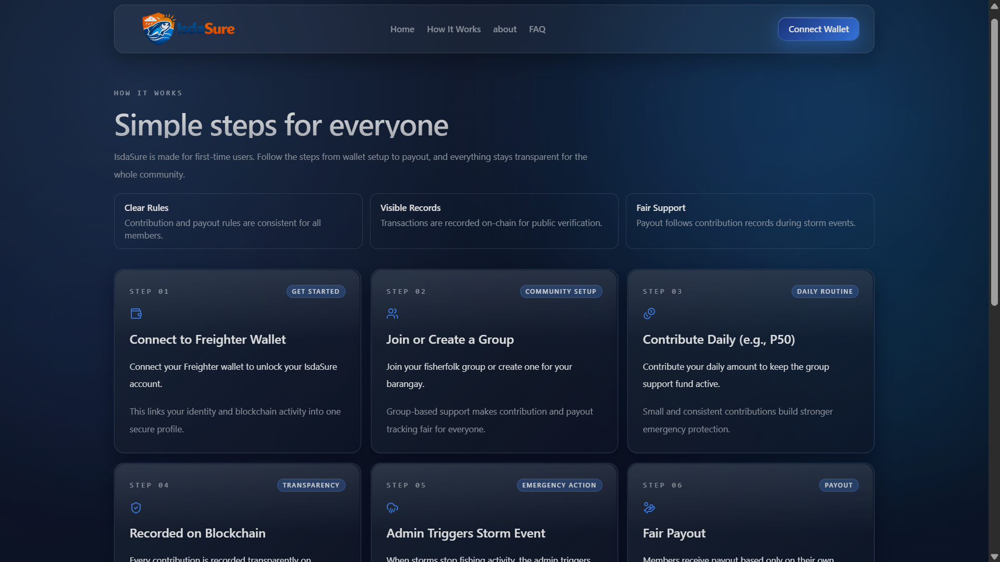<br/>
</td>
</tr>

<tr>
<td width="50%" valign="top">
<b>About Page – Explains the real-world problem (typhoons and income loss) and how IsdaSure offers a fair, community-driven solution.</b><br/><br/>
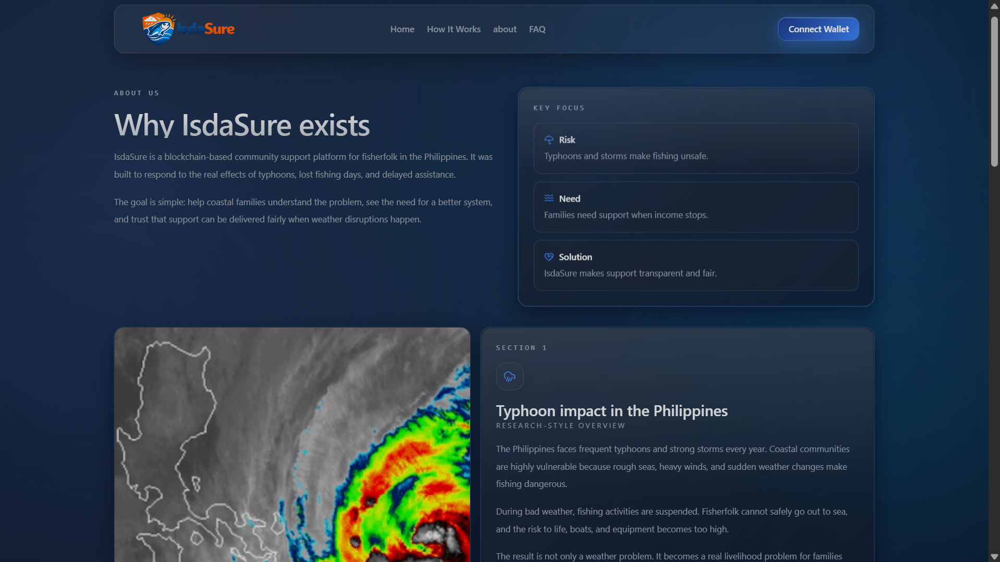<br/>
</td>
<td width="50%" valign="top">
<b>FAQ Page – Answers common questions to help users understand how the platform works and build trust.</b><br/><br/>
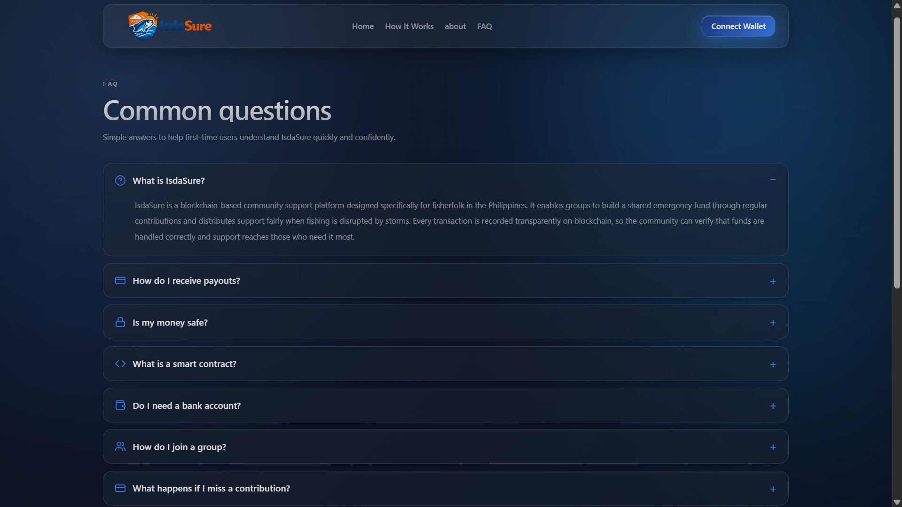<br/>
</td>
</tr>

<tr>
<td width="50%" valign="top">
<b>Role Selection Page – Guides users to choose between roles (Barangay Official, Login, or Register) based on how they want to use IsdaSure.</b><br/><br/>
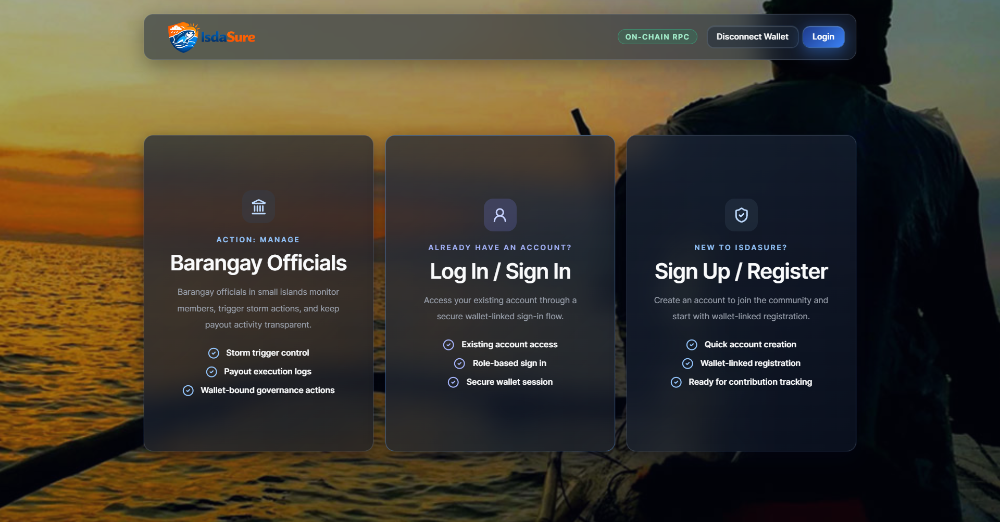<br/>
</td>
<td width="50%" valign="top">
<b>Barangay Official Login Page – Allows authorized barangay officials to access governance tools, trigger storm events, and manage community payouts.</b><br/><br/>
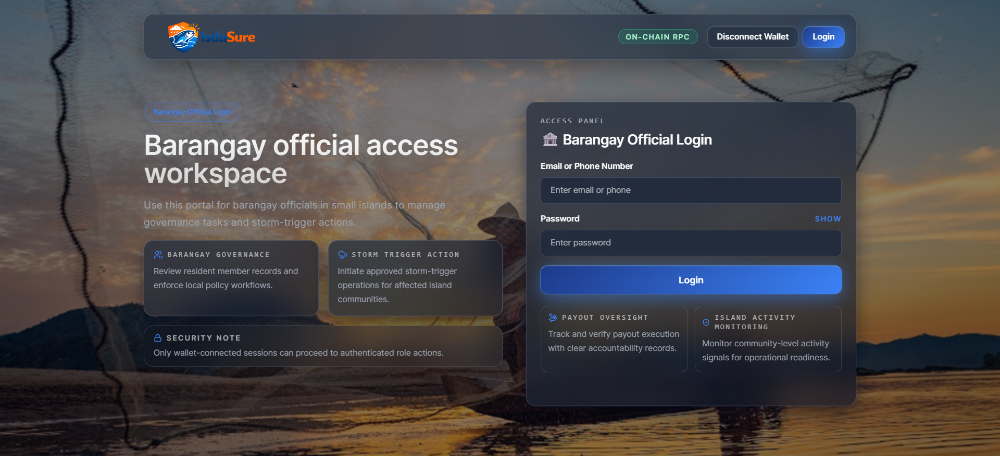<br/>
</td>
</tr>

<tr>
<td width="50%" valign="top">
<b>User Login Page – Enables members to securely access their personal dashboard, contributions, and activity using their account credentials.</b><br/><br/>
<br/>
</td>
<td width="50%" valign="top">
<b>User Registration Page – Lets new Fisherfolks create a profile with wallet-linked identity for secure participation in the platform.</b><br/><br/>
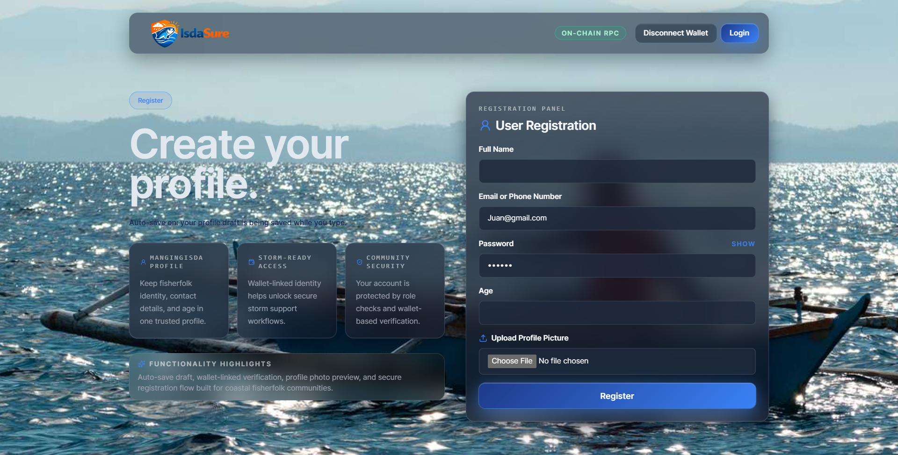<br/>
</td>
</tr>

<tr>
<td width="50%" valign="top">
<b>User Dashboard (Contribute & Group View) – Allows users to join or create groups, contribute funds, and view members, contribution history, and storm events in one place.</b><br/><br/>
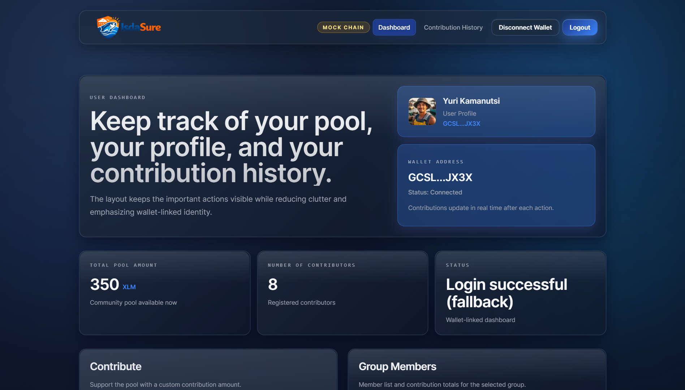<br/>
</td>
<td width="50%" valign="top">
<b>Contribute Section – Users add funds to their group’s shared pool to support future emergency payouts when there's a typhoon.</b><br/><br/>
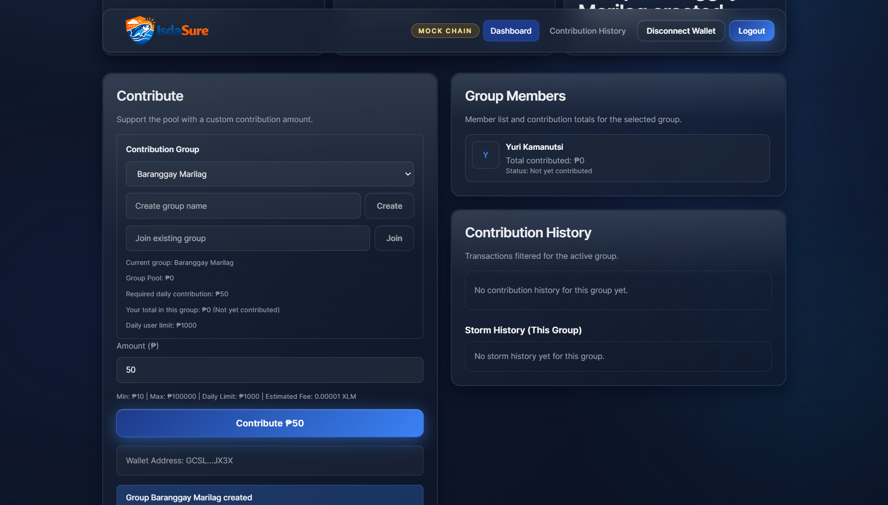<br/>
</td>
</tr>

<tr>
<td width="50%" valign="top">
<b>Admin Dashboard Overview – Provides a summary of total pool funds, number of contributors, and admin status for quick monitoring.</b><br/><br/>
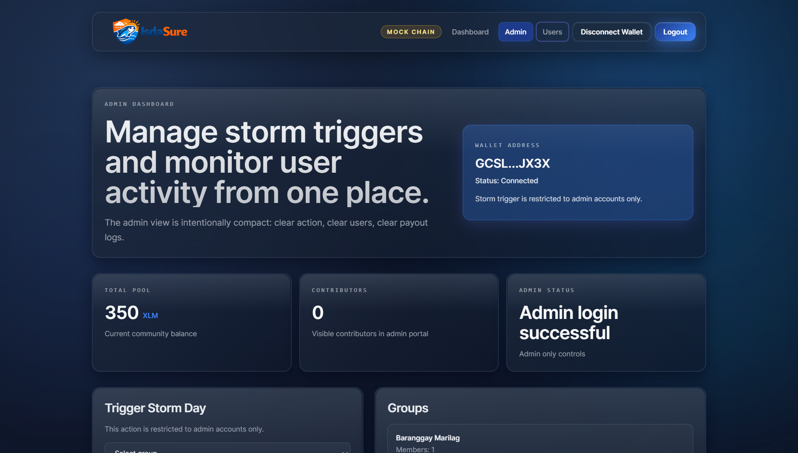<br/>
</td>
<td width="50%" valign="top">
<b>Trigger Storm Day Page – Lets admins activate a storm event for a selected group, enabling payout distribution to affected members.</b><br/><br/>
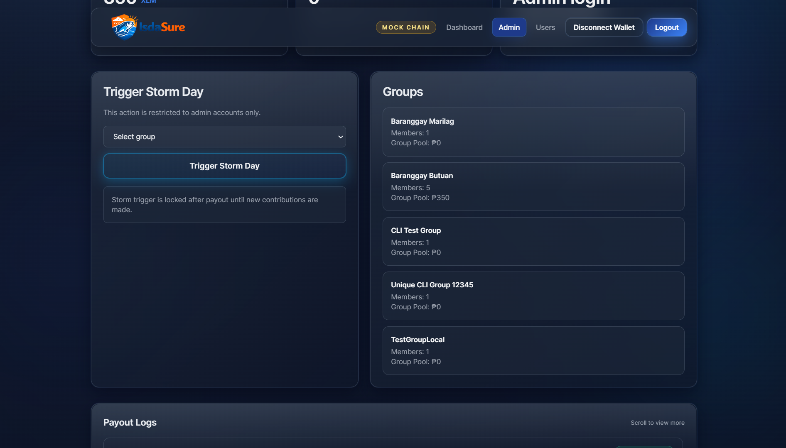<br/>
</td>
</tr>

</table>

---

## 🔌API Endpoints (backend) 

Below is a short summary of the backend API (all routes are under `/_/backend/api`).

- `GET /status` — Returns pool, groups, recentContributions, chainHistory, chainMode, rpcConfigured, contributionRules, etc.
- `POST /contribute/prepare` — Prepare a contribution (returns an unsigned XDR or a mock/fallback). Body: `groupId|groupName`, `amount`, `walletAddress`, `identifier?`, `user?`, `networkPassphrase?`, `contractCall?`.
- `POST /contribute` — Submit signed XDR or record a mocked contribution. Body: `groupId|groupName`, `amount`, `walletAddress`, `identifier?`, `user?`, `signedTxXdr?`, `nonce?`.
- `GET /groups` — List groups.
- `POST /groups/create` — Create a group (provide `groupName` and creator info).
- `POST /groups/join`, `POST /groups/my`, `POST /groups/approve`, `POST /groups/reject` — Join and manage membership.
- `POST /auth/register`, `POST /auth/login`, `GET /auth/users` — Authentication endpoints.
- `POST /triggerStorm/prepare`, `POST /triggerStorm` — Prepare and submit storm-trigger (onchain or mocked).

Notes: the backend records clear `message` and `note` fields for mocked transactions (e.g., `Account not found`, `method not found`, `DNS ENOTFOUND`). See `backend/routes` and `backend/services` for implementation details.

---
## 🧪Testing & Snapshots 

Contract tests use JSON snapshots under `test_snapshots/` to verify state transitions. Run `cargo test` to execute.
<p align="center">
  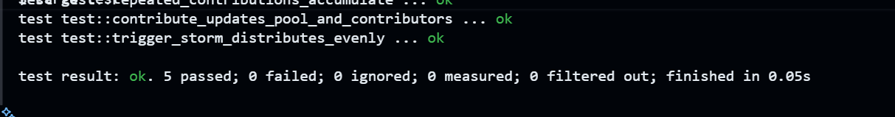
</p>

---

## Notes on Hosted/RPC behavior ☁️

- Vercel has an ephemeral filesystem. Packaged `backend/data/*.json` files are copied into `/tmp` on first run so admin UI can display seeded groups/users.
- Soroban RPC nodes may return `Account not found` for wallets that have not been funded on testnet; the app provides a friendly fallback that allows wallets to sign a lightweight manageData tx so contributions can still be associated with a wallet.

---

## Contributing 🤝

Contributions are welcome — open an issue or a pull request. Please follow the repository's coding style and add tests for contract logic when changing `contract/src`.


