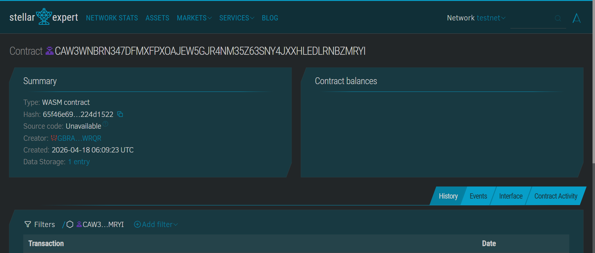

  

<h2 align="center">
  IsdaSure: On-Chain Financial Protection for Coastal Communities 🐟
</h2>

IsdaSure is a Soroban-powered micro-insurance dApp on the Stellar network designed to ensure that fisherfolk are **financially protected during no-fishing days**. Built for coastal communities in the Philippines, it enables users to contribute small, consistent amounts into a shared on-chain fund, creating a reliable safety net during storms and extreme weather conditions.

The name IsdaSure combines <b><i>“Isda”</i></b> (fish) and <b><i>“Sure”<i></b> (security), representing guaranteed support and peace of mind for fisherfolk when they are unable to earn due to unpredictable weather. It reflects a system built not just for technology, but for real communities that depend on daily income to survive.

Instead of relying on delayed aid or high-interest loans, IsdaSure uses Soroban smart contracts to automatically distribute pooled funds when a storm is triggered. All transactions are recorded on-chain, ensuring transparency, fairness, and instant payouts without intermediaries—empowering communities with a decentralized and dependable financial protection system.

<h2 align="center">PROBLEM</h2>

Juan, a small-scale fisherman in a coastal barangay in Batangas, depends on his daily catch to feed his family. On good days, he earns just enough to cover food, fuel, and basic needs. But when a storm hits, Juan cannot go out to sea for days—or even weeks. During this time, his income drops to zero.

With no savings or formal insurance, Juan is forced to borrow money from local lenders just to survive. These loans often come with high interest, trapping him in a cycle of debt every time bad weather strikes. For many fisherfolk like Juan, a single storm doesn’t just stop work—it pushes their families deeper into financial instability, with no reliable system to support them when they need it most.

<h2 align="center">SOLUTION</h2>

With IsdaSure, Juan no longer faces storms alone. On good days, he contributes a small amount from his earnings into a shared community fund using the app. These contributions are securely stored on-chain through a Soroban smart contract, ensuring that the funds are safe and transparently managed.

When a storm hits and fishing becomes impossible, a trusted local authority—such as a barangay officer—triggers the “storm day” event through the system. This action calls the smart contract, which instantly distributes the pooled funds equally to all contributors, including Juan. There are no forms to fill out, no approvals to wait for, and no middlemen involved.

Instead of falling into debt, Juan now has a reliable safety net powered by his own community—allowing him to focus on recovery and return to work once conditions improve.

<h2>UI/UX SCREENSHOTS</h2>

<h2> Stellar Expert Link</h2>

<h4 align="center"><a href="https://stellar.expert/explorer/testnet/contract/CDNZVMTK3RNWWEQTG4JYC55O5P47YYTC2C2ACJVPI5MDJP63TH3KKKKS">Click This to View Contract on Stellar Expert<a></h4>

<h2> Smart Contract Address </h2>

`CDNZVMTK3RNWWEQTG4JYC55O5P47YYTC2C2ACJVPI5MDJP63TH3KKKKS`

<h2> Smart Contract Short Description </h2>
The IsdaSure smart contract is a Soroban-based program deployed on the Stellar network that securely manages the entire lifecycle of the community fund, from collecting contributions to distributing payouts. It allows fisherfolk to contribute small amounts into a shared on-chain pool, where all transactions are recorded transparently and cannot be altered. The contract enforces predefined rules, ensuring that only authorized users—such as a trusted barangay officer—can trigger a storm event. Once triggered, the smart contract automatically calculates and distributes the pooled funds equally among all contributors, eliminating delays, manual processing, and the need for intermediaries. By automating this process, the contract provides a reliable, trustless, and efficient financial safety net that ensures fisherfolk receive immediate support during no-fishing days caused by storms or extreme weather conditions.

<h2>What the IsdaSure Solves</h2>
<ol>
    <li><b>Income Loss During Storms</b> – Fisherfolk depend entirely on daily fishing for income, and when storms or extreme weather occur, they are unable to go out to sea, resulting in a complete loss of earnings for several days or even weeks, leaving families without money for basic needs like food and fuel.</li>
    <li><b>Debt Dependency</b> – Due to the absence of savings or financial safety nets, fisherfolk are often forced to borrow money from informal lenders during no-fishing days, usually at high interest rates, which traps them in a recurring cycle of debt every time bad weather disrupts their livelihood.</li>
    <li><b>Delayed Financial Aid</b> – Government or NGO assistance is not always immediate and may take days or weeks to reach affected communities, making it unreliable for urgent, day-to-day survival during sudden weather disruptions.</li>
    <li><b>Limited Access to Insurance</b> – Traditional insurance services are often inaccessible to small-scale fisherfolk due to high costs, complicated requirements, and lack of availability in rural coastal areas, leaving them without any formal financial protection.</li>
    <li><b>Lack of Transparency</b> – Existing systems for distributing aid or community funds may lack clear tracking and accountability, leading to unequal distribution, mistrust, and uncertainty among beneficiaries, especially in underserved communities.</li>
</ol>

