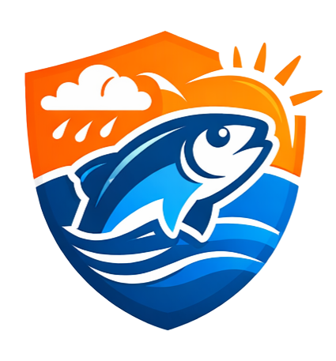

[](https://isda-sure.vercel.app/)
[](https://isda-sure.vercel.app/)
[](https://stellar.expert/explorer/testnet/contract/CDNZVMTK3RNWWEQTG4JYC55O5P47YYTC2C2ACJVPI5MDJP63TH3KKKKS)
[](https://docs.rs/soroban-sdk/22.0.0)
[](https://vitejs.dev/)
[](LICENSE)

<p align="center">
  
</p>

## 🐟 IsdaSure — Community-Powered Storm Protection

IsdaSure is a lightweight Soroban smart-contract application on the Stellar Testnet that enables coastal communities to pool small daily contributions and distribute payouts automatically when extreme weather prevents fishing activity. It is designed for low friction, on-chain transparency, and resilient UX even when RPC nodes are intermittent.

Key ideas:
- Small, frequent contributions from community members
- On-chain pooled fund (Soroban contract) enforcing contribution and payout rules
- Local admin (trusted community officer) triggers the distribution (“storm day”)
- Wallet-signed actions using Freighter for safe key custody

---

IsdaSure is a Soroban-powered micro-insurance dApp on the Stellar network designed to ensure that fisherfolk are **financially protected during no-fishing days**. Built for coastal communities in the Philippines, it enables users to contribute small, consistent amounts into a shared on-chain fund, creating a reliable safety net during storms and extreme weather conditions.

The name IsdaSure combines <b><i>“Isda”</i></b> (fish) and <b><i>“Sure”<i></b> (security), representing guaranteed support and peace of mind for fisherfolk when they are unable to earn due to unpredictable weather. It reflects a system built not just for technology, but for real communities that depend on daily income to survive.

Instead of relying on delayed aid or high-interest loans, IsdaSure uses Soroban smart contracts to automatically distribute pooled funds when a storm is triggered. All transactions are recorded on-chain, ensuring transparency, fairness, and instant payouts without intermediaries—empowering communities with a decentralized and dependable financial protection system.

## 🛑 Problem

Juan, a small-scale fisherman in a coastal barangay in Batangas, depends on his daily catch to feed his family. On good days, he earns just enough to cover food, fuel, and basic needs. But when a storm hits, Juan cannot go out to sea for days—or even weeks. During this time, his income drops to zero.

With no savings or formal insurance, Juan is forced to borrow money from local lenders just to survive. These loans often come with high interest, trapping him in a cycle of debt every time bad weather strikes. For many fisherfolk like Juan, a single storm doesn’t just stop work—it pushes their families deeper into financial instability, with no reliable system to support them when they need it most.

## ✅ Solution

With IsdaSure, Juan no longer faces storms alone. On good days, he contributes a small amount from his earnings into a shared community fund using the app. These contributions are securely stored on-chain through a Soroban smart contract, ensuring that the funds are safe and transparently managed.

When a storm hits and fishing becomes impossible, a trusted local authority—such as a barangay officer—triggers the “storm day” event through the system. This action calls the smart contract, which instantly distributes the pooled funds equally to all contributors, including Juan. There are no forms to fill out, no approvals to wait for, and no middlemen involved.

Instead of falling into debt, Juan now has a reliable safety net powered by his own community—allowing him to focus on recovery and return to work once conditions improve.

## 🖼️ UI/UX SCREENSHOTS

## 🔗 Stellar Expert Link

<h4 align="center"><a href="https://stellar.expert/explorer/testnet/contract/CDNZVMTK3RNWWEQTG4JYC55O5P47YYTC2C2ACJVPI5MDJP63TH3KKKKS">Click This to View Contract on Stellar Expert</a></h4>

## 🧾 Smart Contract Address

`CDNZVMTK3RNWWEQTG4JYC55O5P47YYTC2C2ACJVPI5MDJP63TH3KKKKS`

## 📜 Smart Contract Short Description
The IsdaSure smart contract is a Soroban-based program deployed on the Stellar network that securely manages the entire lifecycle of the community fund, from collecting contributions to distributing payouts. It allows fisherfolk to contribute small amounts into a shared on-chain pool, where all transactions are recorded transparently and cannot be altered. The contract enforces predefined rules, ensuring that only authorized users—such as a trusted barangay officer—can trigger a storm event. Once triggered, the smart contract automatically calculates and distributes the pooled funds equally among all contributors, eliminating delays, manual processing, and the need for intermediaries. By automating this process, the contract provides a reliable, trustless, and efficient financial safety net that ensures fisherfolk receive immediate support during no-fishing days caused by storms or extreme weather conditions.


<h2>What the IsdaSure Solves</h2>
<ol>
    <li><b>Income Loss During Storms</b> – Fisherfolk depend entirely on daily fishing for income, and when storms or extreme weather occur, they are unable to go out to sea, resulting in a complete loss of earnings for several days or even weeks, leaving families without money for basic needs like food and fuel.</li>
    <li><b>Debt Dependency</b> – Due to the absence of savings or financial safety nets, fisherfolk are often forced to borrow money from informal lenders during no-fishing days, usually at high interest rates, which traps them in a recurring cycle of debt every time bad weather disrupts their livelihood.</li>
    <li><b>Delayed Financial Aid</b> – Government or NGO assistance is not always immediate and may take days or weeks to reach affected communities, making it unreliable for urgent, day-to-day survival during sudden weather disruptions.</li>
    <li><b>Limited Access to Insurance</b> – Traditional insurance services are often inaccessible to small-scale fisherfolk due to high costs, complicated requirements, and lack of availability in rural coastal areas, leaving them without any formal financial protection.</li>
    <li><b>Lack of Transparency</b> – Existing systems for distributing aid or community funds may lack clear tracking and accountability, leading to unequal distribution, mistrust, and uncertainty among beneficiaries, especially in underserved communities.</li>
</ol>
---

## ⚙️ How It Works (Summary)

1. Community members create or join a `Group` through the web app and register their identifier (name) and wallet address.
2. Each member contributes a small peso-denominated amount (recorded in contract-local units) daily into the pooled group fund.
3. A local admin triggers `trigger_storm` when fishing is unsafe; the Soroban contract enforces distribution rules and transfers payouts.
4. Contributions, payouts, and history are available in the dashboard for audit and transparency.

The frontend keeps a mirrored view of on-chain state to remain responsive; the backend provides resilient fallbacks and local persistence for a smooth UX in unreliable RPC environments.

## 🚀 Core Functions & Features

- Contribution flows: on-chain record of contributions, per-group daily limits, and validation rules.
- Auto member onboarding: a connected wallet can contribute and be auto-added to the group if allowed.
- Storm trigger: a role-gated admin action that distributes pooled funds evenly to group members.
- Chain / Mock mode: graceful mock confirmations when Soroban RPC is unavailable (configurable with `ALLOW_MOCK_ON_HOSTED`).
- Admin dashboard: view groups, contributors, recent contributions, and payout history.

## 🗂️ Project Structure

```
IsdaSure/
├─ backend/                # Express API, minimal file-based store (production copies packaged data to /tmp)
│  ├─ routes/              # API routes (/contribute, /groups, /auth, /trigger-storm)
│  └─ services/            # groupService, sorobanService, sorobanRpcService, storagePath
├─ frontend/               # Vite + React app (Freighter integration)
│  ├─ src/
│  │  ├─ components/      # UI components
│  │  ├─ context/         # AppContext (central state + flows)
│  │  └─ services/        # api, freighter, contract helpers
├─ contract/               # Soroban Rust contract source and tests
└─ scripts/                # diagnostics (check-contract.js) and helpers
```

## 🏗️ Architecture Overview

- Browser UI (React + Vite) — wallet interactions use Freighter and fallback manageData flows when needed.
- Backend (Express) — orchestrates data, read-from-packaged `backend/data` on hosted runtimes and writes into `/tmp` when deployed on Vercel.
- Soroban contract — enforces contribution/payout rules; the contract ID is set via env `SOROBAN_CONTRACT_ID`.

## 🚀📡 Deployment & Contract Addresses (testnet)

| Layer | Environment | Address |
|---|---:|---|
| Registry Contract | Stellar Testnet | `CDNZVMTK3RNWWEQTG4JYC55O5P47YYTC2C2ACJVPI5MDJP63TH3KKKKS` |
| Live Web App | Vercel (production) | https://isda-sure.vercel.app |
| Network Passphrase | Testnet | `Test SDF Network ; September 2015` |

---

## 🧰 Prerequisites

- Node.js v18+ (frontend + backend)
- Rust toolchain (for building contract WASM)
- `stellar` CLI / Soroban toolchain for contract deployment (optional for local dev)
- Freighter browser extension (for signing transactions)

## 🛠️ Smart Contract Setup & Testing

1. Build contract:

```bash
cd contract
rustup target add wasm32-unknown-unknown
stellar contract build
```

2. Run tests (contract unit snapshots):

```bash
cd contract
cargo test
```

3. Deploy to testnet (example):

```bash
# compile and deploy
cd contract
stellar contract build
stellar contract deploy \
  --wasm target/wasm32-unknown-unknown/release/isdasure.wasm \
  --source MY_ADMIN_KEY \
  --network testnet
```

## 🖥️ Frontend Local Setup

1. Install:

```bash
cd frontend
npm install
```

2. Create `.env` at project root with these keys (example):

```
VITE_API_URL=http://localhost:4000/_/backend/api
VITE_SOROBAN_CONTRACT_ID=CDNZVMTK3RNWWEQTG4JYC55O5P47YYTC2C2ACJVPI5MDJP63TH3KKKKS
VITE_STELLAR_NETWORK_PASSPHRASE="Test SDF Network ; September 2015"
```

3. Run dev server:

```bash
cd frontend
npm run dev
```

## 🧭 Backend Notes (runtime resilience)

- On Vercel, filesystem is ephemeral — this project ships a packaged `backend/data/groups.json` used as seed data and copies it into `/tmp` for runtime writes.
- Important env vars:
  - `SOROBAN_RPC_URL` — RPC endpoint to prepare and submit Soroban transactions (if missing, app falls back to mock confirmations)
  - `SOROBAN_CONTRACT_ID` — contract id for on-chain calls
  - `ALLOW_MOCK_ON_HOSTED` — set to `true` to permit mock confirmations on hosted (not recommended for production)

## 🔁 Contribution Flow (high level)

1. Frontend requests `POST /contribute/prepare` to backend.
2. Backend attempts to call Soroban RPC `prepareTransaction`. If the RPC returns a "method not found" or account-not-found, the backend returns a mocked prepared payload so the frontend will still prompt Freighter for a signature.
3. Frontend signs the unsigned XDR (or generates a signed manageData XDR for mock mode) and submits `POST /contribute` with `signedTxXdr` and `nonce`.
4. Backend tries to submit to Soroban. If submission fails, backend records a mocked confirmation and persists contribution data locally.

This flow ensures any connected Freighter wallet can take part immediately and preserves UX even when RPCs are flaky.

## 🔌 API Endpoints (backend)

- `GET /_/backend/api/status` — current pool state and chainHistory
- `POST /_/backend/api/contribute/prepare` — prepare contribution (returns unsigned XDR or mock mode)
- `POST /_/backend/api/contribute` — submit contribution (signed XDR + nonce)
- `POST /_/backend/api/groups` — list groups
- `POST /_/backend/api/groups/create` — create group
- `POST /_/backend/api/groups/join` — join group

Refer to `backend/routes` for full list.

## ✅ Testing & Snapshots

- This repo includes contract state snapshots in `test_snapshots/` for verifying expected ledger transitions locally. Use them in test harness to validate behavior during contract upgrades.

## 🔒 Security & Operational Notes

- Use `ALLOW_MOCK_ON_HOSTED=true` only for staging or when RPCs are intentionally disabled.
- For production on-chain behavior, ensure `SOROBAN_RPC_URL` points to a reliable Soroban RPC endpoint and `SOROBAN_CONTRACT_ID` matches a deployed contract implementing `contribute` and `trigger_storm`.

## 🤝 Contributing

Contributions are welcome. Open issues for bugs or feature requests. For code contributions, please fork the repo, create a feature branch, and open a PR.

## 📄 License

MIT — see `LICENSE` file.


